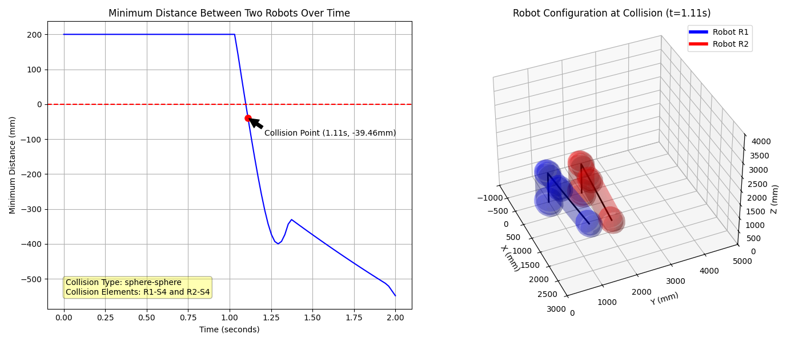

# Robot Collision Detection

[](https://opensource.org/licenses/MIT)
[](https://www.python.org/downloads/)
[](https://github.com/10-OASIS-01/robot-collision-detection)

A Python package for real-time collision detection between industrial robots using simplified geometric models based on spheres and capsules.

<p align="center">  <br> <em>Figure: Dual robot collision simulation showing minimum distance over time (left) and robot configuration at collision point (right)</em> </p>

## Features

- Fast collision detection between dual 6R industrial robots
- Simplified geometric modeling using spheres and capsules
- Distance calculation between various geometric primitives:
  - Sphere-to-sphere
  - Sphere-to-capsule
  - Capsule-to-capsule
- Forward kinematics calculation using DH parameters
- 3D visualization of robot models and collision states
- Distance-time curve plotting for collision analysis
- Support for custom robot geometric models with varying levels of detail
- Performance comparison tools for different modeling approaches

<p align="center">
  
  <br>
  <em>Figure: Custom robot geometric models with varying levels of detail: standard model (left), precise model (middle), and simplified model (right)</em>
</p>

## Package Structure

```
robot_collision_detection/
├── core/
│   ├── robot.py            # Robot class implementation
│   └── kinematics.py       # Forward kinematics using DH parameters
├── distance/
│   ├── primitives.py       # Distance calculations between geometric primitives
│   └── collision.py        # Collision detection algorithms
├── visualization/
│   └── plotting.py         # Functions for 3D visualization and plotting
└── examples/
    ├── base_robot_model.py         # Basic usage example
    ├── dual_robot_simulation.py    # Dynamic simulation with collision detection
    ├── distance_calculation.py     # Distance calculation between primitives
    └── custom_robot_model.py       # Creating custom geometric models
```

## Algorithm

The collision detection algorithm is based on calculating the minimum distance between simplified geometric models of robots:

1. Each robot is represented as a collection of spheres and capsules
2. Forward kinematics is used to position these geometric primitives based on joint angles
3. Distances between all pairs of primitives (one from each robot) are calculated
4. The minimum distance between the robots is the minimum of all calculated distances
5. A negative minimum distance indicates collision

<p align="center">
  
  <br>
  <em>Figure: Distance calculations between different geometric primitives: sphere-sphere (left), sphere-capsule (middle), and capsule-capsule (right)</em>
</p>

For a detailed explanation of the mathematical foundations, refer to the [Algorithm Tutorial](algorithm_tutorial.md).

## Installation

```bash
git clone https://github.com/10-OASIS-01/robot-collision-detection.git
cd robot-collision-detection
pip install -e .
```

## Quick Start

The package includes several example scripts to demonstrate its functionality:

- `examples/base_robot_model.py`: Demonstrates basic usage of the Robot class and visualization
- `examples/dual_robot_simulation.py`: Simulates two robots moving along paths and detects collisions
- `examples/distance_calculation.py`: Shows how to calculate distances between different geometric primitives
- `examples/custom_robot_model.py`: Demonstrates how to define custom robot geometric models with varying levels of detail

Run any example using:
```bash
python -m robot_collision_detection.examples.base_robot_model
```

## Contributing

Contributions are welcome! Please feel free to submit a Pull Request.

1. Fork the repository
2. Create your feature branch (`git checkout -b feature/amazing-feature`)
3. Commit your changes (`git commit -m 'Add some amazing feature'`)
4. Push to the branch (`git push origin feature/amazing-feature`)
5. Open a Pull Request

## License

This project is licensed under the MIT License - see the [LICENSE](LICENSE) file for details.

## References

1. Hunt, K.H. (1978). *Kinematic geometry of mechanisms*. Oxford University Press.
2. Gilbert, E., et al. (1988). *A Fast Procedure for Computing the Distance Between Complex Objects in Three-Dimensional Space*. IEEE Journal of Robotics and Automation, 4(2), 193-203.
3. Cameron, S. (1997). *Enhancing GJK: Computing minimum and penetration distances between convex polyhedra*. Proceedings of International Conference on Robotics and Automation, 3112-3117.
4. Ericson, C. (2005). *Real-Time Collision Detection*. Morgan Kaufmann Publishers.
5. Lin, M.C., et al. (2000). *Fast Proximity Queries with Swept Sphere Volumes*. Proceedings of IEEE International Conference on Robotics and Automation, 3719-3726.

---

Last updated: 2025-05-23 by [10-OASIS-01](https://github.com/10-OASIS-01)