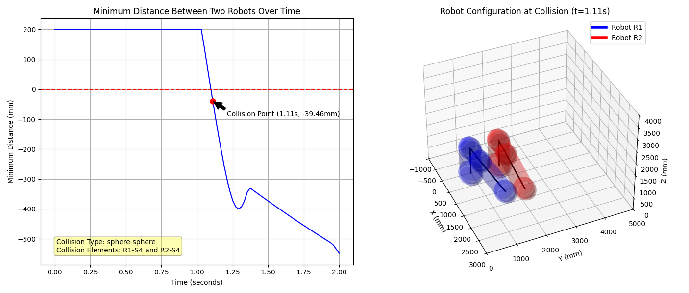
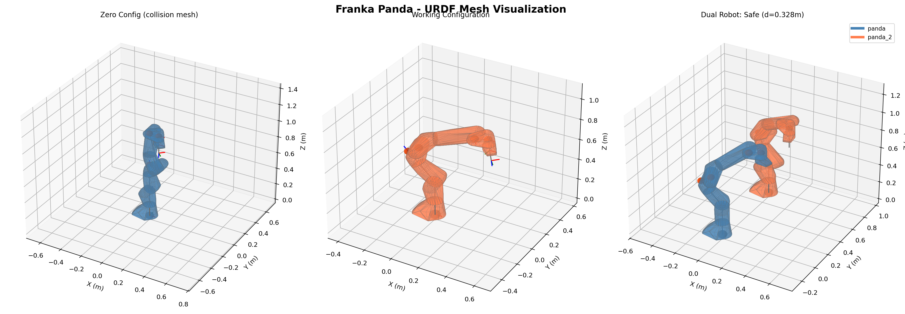
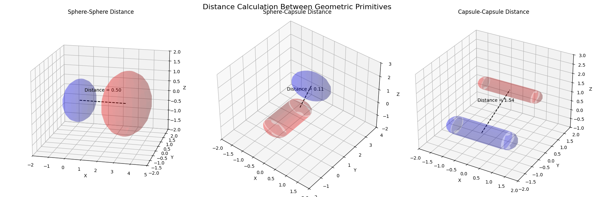

# Robot Collision Detection

[](https://opensource.org/licenses/MIT)
[](https://www.python.org/downloads/)
[]()

A Python package for real-time collision detection, inverse kinematics, and 3D visualization of industrial robots. Supports URDF models with STL mesh rendering, vectorized distance computation, and collision-aware IK solving.

<table>
  <tr>
    <td></td>
  </tr>
  <tr>
    <td><i>Dual robot collision simulation showing minimum distance over time (left) and robot configuration at collision point (right)</i></td>
  </tr>
</table>

## Features

**Collision Detection**
- Vectorized pairwise distance computation (sphere-sphere, sphere-capsule, capsule-capsule) — 7.6x faster than naive loops
- Early termination with configurable threshold for real-time applications
- Self-collision detection with adjacency-aware link filtering
- Dual-robot and multi-robot collision checking

**Inverse Kinematics**
- Damped least-squares (Levenberg-Marquardt) numerical IK solver
- Collision-aware IK with multi-start random restarts to escape local minima
- Joint limit enforcement (auto-read from URDF)
- Adaptive damping and step-size limiting for robust convergence
- Works with both DH-parameter robots and URDF models

**Robot Modeling**
- URDF model loading with automatic kinematic chain extraction
- STL collision mesh loading and 3D visualization
- Auto-fitted per-link capsule radii from mesh bounding boxes
- DH parameter-based robot definition with custom geometric models
- Forward kinematics for arbitrary N-DOF robots

**Visualization**
- 3D mesh rendering of URDF collision/visual geometry
- Joint markers, coordinate frames, and kinematic skeleton overlay
- Distance-time curve plotting for trajectory analysis

<table>
  <tr>
    <td></td>
  </tr>
  <tr>
    <td><i>Franka Panda loaded from URDF: zero configuration (left), working configuration (center), and dual-robot collision check (right)</i></td>
  </tr>
</table>

## Installation

```bash
git clone https://github.com/10-OASIS-01/robot-collision-detection.git
cd robot-collision-detection
pip install -e ".[dev]"
```

## Quick Start

### Dual-Robot Collision Detection

```python
import numpy as np
from robot_collision_detection import Robot, min_distance_between_robots

dh_params = [[0, 0, 1100], [600, np.pi/2, 0], [1400, 0, 0]]
robot1 = Robot(dh_params, name="R1")
robot2 = Robot(dh_params, base_transform=T_base, name="R2")

angles = np.radians([0, -45, -20])
transforms = robot1.forward_kinematics(angles)
robot1.update_geometric_model(transforms)

dist, coll_type, elements = min_distance_between_robots(robot1, robot2)
```

### Loading a URDF Robot

```python
from robot_collision_detection import URDFRobot, min_distance_between_robots

robot = URDFRobot("franka.urdf", auto_radius=True)
print(f"{robot.name}: {robot.num_joints} joints")

transforms = robot.forward_kinematics(np.zeros(robot.num_joints))
robot.update_geometric_model(transforms)

# Early termination — return as soon as collision is found
dist, _, _ = min_distance_between_robots(robot1, robot2, threshold=0.0)
```

### Inverse Kinematics

```python
from robot_collision_detection import URDFRobot, inverse_kinematics

robot = URDFRobot("franka.urdf", auto_radius=True)

# Define target end-effector pose (4x4 homogeneous transform)
target_pose = robot.forward_kinematics([0.3, -0.5, 0.2, -1.8, 0.1, 1.2, 0.4])[-1]

# Solve IK
result = inverse_kinematics(robot, target_pose, pos_tol=1e-4, ori_tol=1e-3)
print(result)  # IKResult(OK, pos_err=0.000012, ori_err=0.000002, iters=4)
```

### Collision-Free Inverse Kinematics

```python
from robot_collision_detection import (
    URDFRobot, inverse_kinematics_collision_free
)

robot = URDFRobot("franka.urdf", auto_radius=True)
obstacle = URDFRobot("franka.urdf", base_transform=T_base2)

# Solve IK while avoiding self-collision and obstacles
result = inverse_kinematics_collision_free(
    robot, target_pose,
    obstacles=[obstacle],
    self_collision=True,
    max_attempts=20,
)
if result.success and result.collision_free:
    print(f"Solution: {np.degrees(result.joint_angles).round(1)} deg")
```

### Self-Collision Detection

```python
from robot_collision_detection import URDFRobot, min_distance_within_robot

robot = URDFRobot("franka.urdf", auto_radius=True)
transforms = robot.forward_kinematics(joint_angles)
robot.update_geometric_model(transforms)

dist, coll_type, elements = min_distance_within_robot(robot, skip_adjacent=1)
if dist < 0:
    print(f"Self-collision: {elements[0]} <-> {elements[1]}")
```

### Visualization

```python
import matplotlib.pyplot as plt
from robot_collision_detection import URDFRobot
from robot_collision_detection.visualization.plotting import plot_urdf_robot

robot = URDFRobot("franka.urdf")
fig = plt.figure()
ax = fig.add_subplot(111, projection='3d')

plot_urdf_robot(ax, robot, joint_angles, color='steelblue',
                show_mesh='collision', show_frames=True)
plt.show()
```

## Examples

| Script | Description |
|--------|-------------|
| `examples/base_dual_robot_model.py` | Basic dual-robot setup and visualization |
| `examples/dual_robot_simulation.py` | Dynamic trajectory simulation with collision detection |
| `examples/distance_calculation.py` | Distance computation between geometric primitives |
| `examples/custom_robot_model.py` | Custom geometric models with precision/speed tradeoffs |
| `examples/urdf_robot_example.py` | URDF loading, mesh visualization, and dual-robot check |

```bash
python examples/dual_robot_simulation.py
python examples/urdf_robot_example.py path/to/robot.urdf
```

## Package Structure

```
robot_collision_detection/
├── core/
│   ├── robot.py              # Robot class (DH parameters)
│   ├── kinematics.py         # DH transformation matrices
│   ├── urdf_loader.py        # URDF parser and URDFRobot class
│   ├── stl_loader.py         # Binary STL mesh loader
│   └── ik_solver.py          # Numerical IK and collision-aware IK
├── distance/
│   ├── primitives.py         # Sphere/capsule/segment distance functions
│   └── collision.py          # Vectorized collision detection & self-collision
├── visualization/
│   └── plotting.py           # 3D mesh rendering, coordinate frames, plotting
└── tests/
    ├── test_primitives.py    # Distance function tests (incl. edge cases)
    ├── test_kinematics.py    # DH transform verification
    ├── test_robot.py         # Forward kinematics & geometric model tests
    ├── test_urdf_loader.py   # URDF parsing & joint chain tests
    ├── test_collision.py     # Vectorized collision & self-collision tests
    └── test_ik_solver.py     # IK solver, Jacobian, and collision-free IK tests
```

## Algorithm

**For a detailed explanation of the mathematical foundations, see the [Algorithm Tutorial](algorithm_tutorial.md).**

### Collision Detection Pipeline

1. Each robot link is wrapped in spheres and capsules (auto-fitted from mesh or manually defined)
2. Forward kinematics positions all primitives in world coordinates
3. Vectorized numpy broadcasts compute all pairwise distances in one pass
4. Optional early termination returns immediately when any distance < threshold
5. Self-collision checks mask adjacent link pairs before searching

### Inverse Kinematics

The IK solver uses the damped least-squares (Levenberg-Marquardt) method:

1. Compute the 6xN Jacobian via numerical finite differences
2. Solve `dq = J^T (J J^T + lambda^2 I)^{-1} e` where `e` is the 6D pose error
3. Adaptive damping: `lambda` scales with position error for stability
4. Step-size limiting: joint updates capped at 0.5 rad/step to prevent oscillation
5. Joint limits enforced by clamping after each iteration

For collision-free IK, multiple random starting configurations are tried, and each solution is verified against self-collision and obstacle constraints.

<table>
  <tr>
    <td></td>
  </tr>
  <tr>
    <td><i>Distance calculations between geometric primitives: sphere-sphere (left), sphere-capsule (middle), and capsule-capsule (right)</i></td>
  </tr>
</table>

## Performance

Benchmarked on Franka Panda 7-DOF (19 primitives per robot, 361 pairs):

| Operation | Time | Notes |
|-----------|------|-------|
| Dual-robot collision | **0.16 ms** | Vectorized, 7.6x vs naive loops |
| Collision with early exit | **0.17 ms** | `threshold=0.0` |
| Self-collision detection | **0.15 ms** | `skip_adjacent=1` |
| IK solve (nearby start) | **~4 iters** | Position error < 0.01 mm |
| Collision-free IK | **~5 iters** | Multi-start with obstacle avoidance |

## API Reference

| Function / Class | Description |
|------------------|-------------|
| `Robot(dh_params, base_transform, name)` | Robot from DH parameters |
| `URDFRobot(urdf_path, capsule_radius, auto_radius)` | Robot from URDF file |
| `inverse_kinematics(robot, target_pose, ...)` | Numerical IK solver (damped least-squares) |
| `inverse_kinematics_collision_free(robot, target_pose, obstacles, ...)` | IK with collision avoidance |
| `min_distance_between_robots(r1, r2, threshold)` | Minimum distance between two robots |
| `min_distance_within_robot(robot, skip_adjacent, threshold)` | Self-collision check |
| `plot_robot(ax, robot, angles, color)` | Plot robot with collision primitives |
| `plot_urdf_robot(ax, robot, angles, show_mesh, show_frames)` | Plot URDF robot with STL meshes |

## Testing

```bash
pip install -e ".[dev]"
pytest tests/ -v
```

## Contributing

Contributions are welcome! Please feel free to submit a Pull Request.

1. Fork the repository
2. Create your feature branch (`git checkout -b feature/amazing-feature`)
3. Commit your changes (`git commit -m 'Add some amazing feature'`)
4. Push to the branch (`git push origin feature/amazing-feature`)
5. Open a Pull Request

## License

This project is licensed under the MIT License - see the [LICENSE](LICENSE) file for details.

## References

1. Ericson, C. (2005). *Real-Time Collision Detection*. Morgan Kaufmann Publishers.
2. Gilbert, E., et al. (1988). *A Fast Procedure for Computing the Distance Between Complex Objects in Three-Dimensional Space*. IEEE Journal of Robotics and Automation, 4(2), 193-203.
3. Buss, S.R. (2004). *Introduction to Inverse Kinematics with Jacobian Transpose, Pseudoinverse and Damped Least Squares Methods*. UC San Diego.
4. Lin, M.C., et al. (2000). *Fast Proximity Queries with Swept Sphere Volumes*. Proceedings of IEEE International Conference on Robotics and Automation, 3719-3726.
5. Cameron, S. (1997). *Enhancing GJK: Computing minimum and penetration distances between convex polyhedra*. Proceedings of International Conference on Robotics and Automation, 3112-3117.
6. Hunt, K.H. (1978). *Kinematic geometry of mechanisms*. Oxford University Press.
