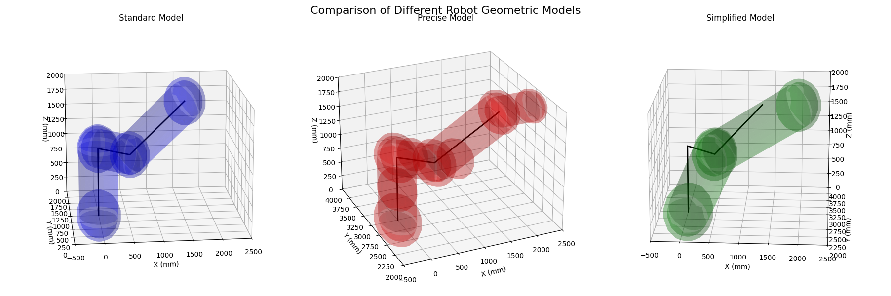
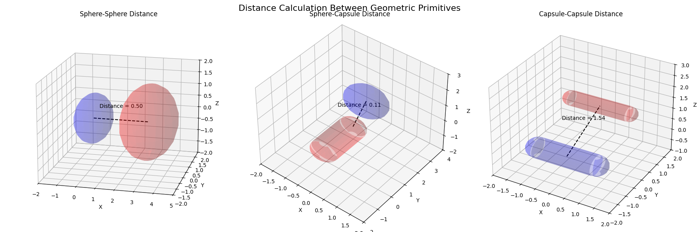

# Algorithm Tutorial for Robot Collision Detection

## 1. Introduction

This tutorial explains the mathematical foundations and implementation details of the dual-robot collision detection algorithm used in our `robot_collision_detection` package. The algorithm enables efficient detection of potential collisions between two 6R industrial robots by using simplified geometric models.

## 2. Robot Geometric Modeling

### 2.1 Simplified Representation of 6R Robots

6R industrial robots have six revolute joints that provide six degrees of freedom. For collision detection purposes, we can simplify the robot model by focusing on the first three joints, which primarily determine the position of the robot's end-effector in space.

Our simplification approach represents the robot's components using two types of geometric primitives:
- **Spheres** for joints (where geometric dimensions are typically larger)
- **Capsules** for links (which are typically elongated structures)

A 6R robot in our model is represented by:
- 4 spheres ($S_1$ through $S_4$) for the base and joints
- 3 capsules ($C_1$ through $C_3$) for the links

The simplified geometric model is defined in the `Robot.init_geometric_model()` function.

### 2.2 Mathematical Representation

#### 2.2.1 Sphere Definition

Each sphere is defined by a center point $c = (c_x, c_y, c_z)$ and a radius $r$. In our model, a sphere $S_i$ can be mathematically represented as:

$$S_i = \{p \in \mathbb{R}^3 : \|p - c_i\| \leq r_i\}$$

where $\|\cdot\|$ denotes the Euclidean norm.

Our implementation stores spheres as a list of pairs:
$$\text{spheres} = \{[c_1, r_1], [c_2, r_2], \ldots, [c_n, r_n]\}$$

#### 2.2.2 Capsule Definition

Each capsule is defined by two endpoints $p_1 = (p_{1x}, p_{1y}, p_{1z})$ and $p_2 = (p_{2x}, p_{2y}, p_{2z})$ representing the centerline segment, and a radius $r$. Mathematically, a capsule $C_i$ is:

$$C_i = \{p \in \mathbb{R}^3 : \|p - q\| \leq r_i \text{ for some } q \in L_i\}$$

where $L_i$ is the line segment from $p_1$ to $p_2$:

$$L_i = \{p_1 + t(p_2 - p_1) : t \in [0,1]\}$$

Our implementation stores capsules as a list of triples:
$$\text{capsules} = \{[p_{1,1}, p_{1,2}, r_1], [p_{2,1}, p_{2,2}, r_2], \ldots, [p_{n,1}, p_{n,2}, r_n]\}$$

#### 2.2.3 Complete Geometric Robot Model

The complete geometric model of a robot $R$ is the union of its spheres and capsules:

$$R = \left(\bigcup_{i=1}^{n_s} S_i\right) \cup \left(\bigcup_{j=1}^{n_c} C_j\right)$$

where $n_s$ is the number of spheres and $n_c$ is the number of capsules.

For our standard 6R robot model, we have:
- $n_s = 4$ (base and three joint spheres)
- $n_c = 3$ (three link capsules)

<table>
  <tr>
    <td></td>
  </tr>
  <tr>
    <td><i>Figure 2.1: Custom robot geometric models with varying levels of detail: standard model (left), precise model (middle), and simplified model (right)</i></td>
  </tr>
</table>

#### 2.2.4 Configuration-Dependent Model

The positions of spheres and capsules depend on the robot's joint configuration. For a joint configuration $\theta = (\theta_1, \theta_2, \ldots, \theta_n)$, the positions are determined by:

$$c_i(\theta) = f_i(\theta) \quad \text{for spheres}$$
$$p_{j,1}(\theta) = g_{j,1}(\theta), \quad p_{j,2}(\theta) = g_{j,2}(\theta) \quad \text{for capsules}$$

where $f_i$, $g_{j,1}$, and $g_{j,2}$ are functions defined by the robot's forward kinematics.

In our implementation, these functions are computed in the `forward_kinematics()` and `update_geometric_model()` methods of the `Robot` class.

## 3. Distance Calculation Between Geometric Primitives

The core of our collision detection algorithm involves calculating the minimum distance between geometric primitives. Distance calculations are implemented in the module `distance.primitives`.

<table>
  <tr>
    <td></td>
  </tr>
  <tr>
    <td><i>Figure 3.1: Distance calculations between different geometric primitives: sphere-sphere (left), sphere-capsule (middle), and capsule-capsule (right)</i></td>
  </tr>
</table>

### 3.1 Sphere-to-Sphere Distance

The distance between two spheres with centers $c_1$, $c_2$ and radii $r_1$, $r_2$ is:

$$d(S_1, S_2) = \|c_1 - c_2\| - (r_1 + r_2)$$

where $\|c_1 - c_2\|$ is the Euclidean distance between the centers.

Implementation: `dist_sphere_sphere(s1, s2)` function

### 3.2 Point-to-Line Segment Distance

For sphere-to-capsule and capsule-to-capsule distance calculations, we need to first understand how to calculate the distance from a point to a line segment.

Given a point $p$ and a line segment defined by endpoints $a$ and $b$, the closest point on the segment to $p$ can be parameterized as:

$$q(t) = a + t(b-a)$$

where $t \in [0,1]$. The parameter $t$ that minimizes the distance is:

$$t = \frac{(p-a) \cdot (b-a)}{\|b-a\|^2}$$

clamped to the range $[0,1]$. The distance is then:

$$d(p, segment) = \|p - q(t)\|$$

Implementation: `dist_point_segment(p, seg_start, seg_end)` function

### 3.3 Sphere-to-Capsule Distance

The distance between a sphere with center $c$ and radius $r_s$ and a capsule with centerline segment endpoints $p_1$, $p_2$ and radius $r_c$ is:

$$d(S, C) = d(c, segment) - (r_s + r_c)$$

where $d(c, segment)$ is the point-to-segment distance calculated above.

Implementation: `dist_sphere_capsule(sphere, capsule)` function

### 3.4 Capsule-to-Capsule Distance

The distance between two capsules is determined by the distance between their centerline segments minus the sum of their radii:

$$d(C_1, C_2) = d(L_1, L_2) - (r_1 + r_2)$$

where $L_1$ and $L_2$ are the centerline segments of the capsules, and $r_1$ and $r_2$ are their respective radii.

This requires calculating the minimum distance between two line segments in 3D space.

Implementation: `dist_capsule_capsule(c1, c2)` function which calls `dist_segment_segment()` internally

### 3.5 Line Segment-to-Line Segment Distance

Let's define two line segments:

$$L_1: M(s) = M_0 + s(M_1 - M_0) = M_0 + su, \quad s \in [0,1]$$
$$L_2: N(t) = N_0 + t(N_1 - N_0) = N_0 + tv, \quad t \in [0,1]$$

where $M_0$, $M_1$ are endpoints of $L_1$ and $N_0$, $N_1$ are endpoints of $L_2$.

The squared distance between a point on $L_1$ and a point on $L_2$ is:

$$F(s,t) = \|M(s) - N(t)\|^2 = as^2 + 2bst + ct^2 + 2ds + 2et + f$$

where:
- $a = u \cdot u$
- $b = -u \cdot v$
- $c = v \cdot v$
- $d = u \cdot r$ (where $r = M_0 - N_0$)
- $e = -v \cdot r$
- $f = r \cdot r$

To find the minimum distance, we need to minimize $F(s,t)$ subject to $0 \leq s \leq 1$ and $0 \leq t \leq 1$.

Two cases arise:

1. **Interior Solution**: If the minimum of $F(s,t)$ is achieved at an interior point of the domain. Setting the gradient of $F(s,t)$ to zero:
   
$$
\begin{aligned}
\nabla F(s,t) &= \begin{pmatrix} 2as + 2bt + 2d \\ 2bs + 2ct + 2e \end{pmatrix} = \begin{pmatrix} 0 \\ 0 \end{pmatrix} \\
\end{aligned}
$$

   This gives:
   $$s_c = \frac{be - cd}{ac - b^2}$$
   $$t_c = \frac{bd - ae}{ac - b^2}$$

   If $0 \leq s_c \leq 1$ and $0 \leq t_c \leq 1$, then the minimum distance is $\sqrt{F(s_c, t_c)}$.

2. **Boundary Solution**: If the minimum occurs on the boundary of the domain, we need to check each edge:
   - $s=0$, $0 \leq t \leq 1$: Distance from $M_0$ to segment $L_2$
   - $s=1$, $0 \leq t \leq 1$: Distance from $M_1$ to segment $L_2$
   - $0 \leq s \leq 1$, $t=0$: Distance from segment $L_1$ to $N_0$
   - $0 \leq s \leq 1$, $t=1$: Distance from segment $L_1$ to $N_1$

   The minimum distance is the minimum of these four cases.

Implementation: `dist_segment_segment(seg1_start, seg1_end, seg2_start, seg2_end)` function

## 4. Collision Detection Algorithm

The overall collision detection algorithm combines the distance calculations for all combinations of geometric primitives between two robots. It is implemented in the `min_distance_between_robots()` function in the `distance.collision` module.
Let the geometric models of the two robots be represented as:
$$R_1 = \{S_1^1, S_1^2, \ldots, S_1^{n_{s1}}\} \cup \{C_1^1, C_1^2, \ldots, C_1^{n_{c1}}\}$$
$$R_2 = \{S_2^1, S_2^2, \ldots, S_2^{n_{s2}}\} \cup \{C_2^1, C_2^2, \ldots, C_2^{n_{c2}}\}$$

where $S_i^j$ denotes the $j$-th sphere of the $i$-th robot, and $C_i^j$ denotes the $j$-th capsule of the $i$-th robot.

Let $d_{SS}$, $d_{SC}$, and $d_{CC}$ be the distance calculation functions for sphere-sphere, sphere-capsule, and capsule-capsule pairs as defined in Section 3.

The collision detection algorithm can be formally described as:

**Algorithm**: Minimum Distance Calculation Between Robots  
**Input**: Two robot geometric models $R_1$ and $R_2$  
**Output**: Minimum distance $d_{min}$, collision type $\tau$, collision elements $\varepsilon$

**Steps**:
1. Initialize $d_{min} \leftarrow +\infty$, $\tau \leftarrow \emptyset$, $\varepsilon \leftarrow \emptyset$

2. **Sphere-to-Sphere Distance Calculation**:
   $$\forall (S_1^i, S_2^j) \in R_1.spheres \times R_2.spheres:$$
   
   Compute $d \leftarrow d_{SS}(S_1^i, S_2^j)$
   
   If $d < d_{min}$, then:
   $$d_{min} \leftarrow d$$
   $$\tau \leftarrow \text{"sphere-sphere"}$$
   $$\varepsilon \leftarrow \{R_1.name\text{-}S^i, R_2.name\text{-}S^j\}$$

3. **Sphere-to-Capsule Distance Calculation**:
   $$\forall (S_1^i, C_2^j) \in R_1.spheres \times R_2.capsules:$$
   
   Compute $d \leftarrow d_{SC}(S_1^i, C_2^j)$
   
   If $d < d_{min}$, then:
   $$d_{min} \leftarrow d$$
   $$\tau \leftarrow \text{"sphere-capsule"}$$
   $$\varepsilon \leftarrow \{R_1.name\text{-}S^i, R_2.name\text{-}C^j\}$$

4. **Capsule-to-Sphere Distance Calculation**:
   $$\forall (C_1^i, S_2^j) \in R_1.capsules \times R_2.spheres:$$
   
   Compute $d \leftarrow d_{SC}(S_2^j, C_1^i)$
   
   If $d < d_{min}$, then:
   $$d_{min} \leftarrow d$$
   $$\tau \leftarrow \text{"capsule-sphere"}$$
   $$\varepsilon \leftarrow \{R_1.name\text{-}C^i, R_2.name\text{-}S^j\}$$

5. **Capsule-to-Capsule Distance Calculation**:
   $$\forall (C_1^i, C_2^j) \in R_1.capsules \times R_2.capsules:$$
   
   Compute $d \leftarrow d_{CC}(C_1^i, C_2^j)$
   
   If $d < d_{min}$, then:
   $$d_{min} \leftarrow d$$
   $$\tau \leftarrow \text{"capsule-capsule"}$$
   $$\varepsilon \leftarrow \{R_1.name\text{-}C^i, R_2.name\text{-}C^j\}$$

6. Return $(d_{min}, \tau, \varepsilon)$

A collision is detected when the minimum distance $d_{min} < 0$.

**Time Complexity Analysis**:
robot, and $n_2 = n_{s2} + n_{c2}$ for the second robot. The algorithm performs pairwise distance calculations between all primitives, resulting in the following complexity breakdown:

- **Sphere-to-sphere detection**: $O(n_{s1} \cdot n_{s2})$
- **Sphere-to-capsule detection**: $O(n_{s1} \cdot n_{c2} + n_{s2} \cdot n_{c1})$
- **Capsule-to-capsule detection**: $O(n_{c1} \cdot n_{c2})$

The overall time complexity is $O(n_1 \cdot n_2)$. If Robot 1 has $m$ primitives and Robot 2 has $n$ primitives, the algorithm has $O(mn)$ complexity in terms of distance calculations.

The most expensive operation is the capsule-to-capsule distance calculation, which requires calculating the minimum distance between two line segments in 3D space. Despite this, the entire algorithm is significantly more efficient than methods using finer discretization or more complex geometric representations, making it suitable for real-time applications.

## 5. Forward Kinematics and Model Update

To detect collisions during robot motion, we need to update the positions of the geometric primitives based on the robot's joint angles.

### 5.1 Forward Kinematics using DH Parameters

Forward kinematics is implemented using the standard Denavit-Hartenberg (DH) convention:

$$T_i^{i-1} = \begin{bmatrix}
\cos\theta_i & -\sin\theta_i\cos\alpha_i & \sin\theta_i\sin\alpha_i & a_i\cos\theta_i \\
\sin\theta_i & \cos\theta_i\cos\alpha_i & -\cos\theta_i\sin\alpha_i & a_i\sin\theta_i \\
0 & \sin\alpha_i & \cos\alpha_i & d_i \\
0 & 0 & 0 & 1
\end{bmatrix}$$

The transformation from the base frame to the end-effector is the product of these individual transformations:

$$T_n^0 = T_1^0 \cdot T_2^1 \cdot \ldots \cdot T_n^{n-1}$$

Implementation: `dh_transform(a, alpha, d, theta)` in `core.kinematics` and `forward_kinematics(joint_angles)` in `Robot` class.

### 5.2 Geometric Model Update

After computing the forward kinematics, the positions of spheres and capsules are updated to reflect the robot's current configuration. For a robot with configuration $\theta$, the positions are updated as follows:

1. **Sphere centers**: Each sphere center $c_i$ is updated to match the position of the corresponding joint frame origin:
   $$c_i = T_i^0(\theta)[:3, 3]$$
   
2. **Capsule endpoints**: Each capsule represents a link connecting two joints, so its endpoints are updated to match the positions of the corresponding joint frame origins:
   $$p_{j,1} = T_{j-1}^0(\theta)[:3, 3]$$
   $$p_{j,2} = T_j^0(\theta)[:3, 3]$$

The model update process is implemented in the `update_geometric_model(transforms)` method, which takes the list of transformation matrices computed by `forward_kinematics()`.

## 6. Visualization

The package includes visualization tools to display:
1. The minimum distance between the robots over time
2. 3D visualizations of the robots at any configuration, including at the moment of collision

These are implemented in the `visualization.plotting` module, with functions such as `plot_sphere()`, `plot_capsule()`, and `plot_robot()`.

## Conclusion

The dual-robot collision detection algorithm presented here offers an efficient approach to detecting collisions between industrial robots using simplified geometric models. By representing robots as collections of spheres and capsules and implementing efficient distance calculation algorithms, we can quickly determine if two robots are at risk of collision, making this approach suitable for real-time applications.

For implementation details, refer to the `robot_collision_detection` package documentation and source code.
